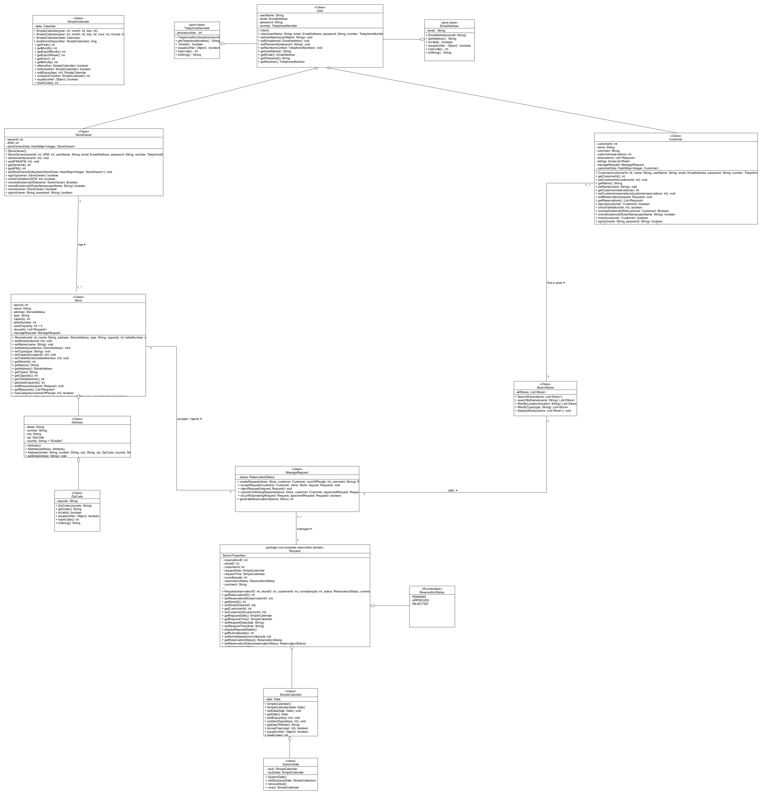

# Online Restaurant Reservation & Management Platform

## Overview

This project is an online platform for restaurant reservation and management, designed to improve the interaction between customers and store owners.

The system replaces traditional phone-based reservations with a structured digital workflow, allowing users to search, book, and manage reservations efficiently while providing store owners with tools for availability control and analytics.

---

## System Purpose

The goal of the system is to:

- Simplify restaurant reservation management
- Improve customer experience through structured search and booking
- Provide store owners with better control over availability
- Offer statistical insights for decision-making

---

## User Roles

### Customer
Customers can:
- Create and manage an account
- Search for restaurants based on filters
- Submit reservation requests
- Cancel reservations
- Rate visited restaurants
- View upcoming bookings and notifications

### Store Owner
Store owners can:
- Register and manage a business profile
- Define restaurant characteristics (location, pricing, capacity, etc.)
- Accept or reject reservation requests
- Monitor table availability
- Access occupancy and usage statistics

---

## Core Functionality

### 1. Search and Filtering

Customers can search for restaurants using:
- Date and time
- Geographic area (e.g. Chalandri, Galatsi)
- Minimum rating
- Price range
- Number of guests

Location-based search is also supported using user preferences.

---

### 2. Availability Management

The system automatically filters restaurants based on availability.

Table allocation rules:
- 1 table → up to 4 people  
- 2 tables → 5–6 people  
- 3 tables → 7–8 people  
- and so on

Only restaurants that can fulfill the request are displayed.

---

### 3. Reservation Workflow

1. Customer submits reservation request  
2. Request is sent to store owner  
3. Store owner approves or rejects request  
4. If approved:
   - Reservation is confirmed
   - Conflicting requests are automatically cancelled

---

### 4. Reservation Management

Customers have access to a personal dashboard that allows:
- Viewing upcoming reservations
- Cancelling bookings
- Receiving notifications before reservation time

---

### 5. Ratings & Analytics

- Customers can rate restaurants after visits
- Store owners can view occupancy statistics
- Users can view general popularity/availability trends by date

---

## System Design

### Use Case Diagram

---

### Class Diagram

---

## Functional Requirements

### UC1 – User Registration  
[Details](team06/docs/markdown/uc1-register-costumer.md)

### UC2 – Store Owner Registration  
[Details](team06/docs/markdown/uc2-register-store-owner.md)

### UC3 – Request Management  
[Details](team06/docs/markdown/uc3-manage-requests.md)

### UC4 – Table Reservation  
[Details](team06/docs/markdown/uc4-table-reservation.md)

### UC5 – Ratings

### UC6 – Occupancy Statistics  

### UC7 – Upcoming Reservations  

### UC8 – Store Search  
[Details](team06/docs/markdown/uc8-search-stores.md)

---

## Notes

- The system is designed as a conceptual software engineering project.
- Focus is placed on system design, use cases, and workflow modeling rather than deployment.
- Diagrams and documentation are used to represent system structure and behavior.

---

## Author

Joanna Papadakaki
