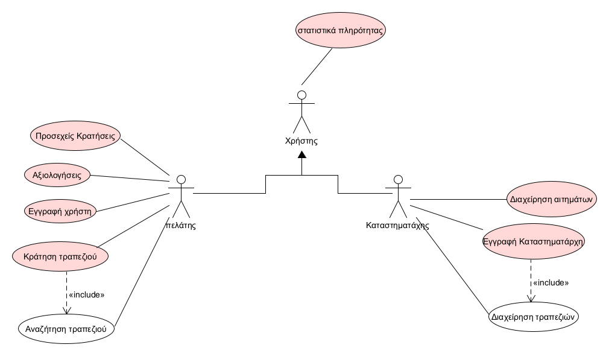

# Online Reservation and Restaurant Space Management Platform

## Use Case Diagram Documentation

The software aims to optimize the experience for both customers and store owners. Reservation management becomes easy and modern, eliminating the need for phone calls, while improving customer information access and efficient business management through statistics and search filters.

---

## 1. User Account and Profile Creation

### Customers:
Customers create an account using email, enter contact details (full name, phone number), and gain access to reservation and store rating features.

### Store Owners:
Store owners create a profile for their business, providing information such as:
- Type of venue
- Price level
- Location
- Capacity (number of tables)

---

## 2. Reservations and Availability Management

### Search Criteria:
Customers search for restaurant availability by entering criteria such as:
- Date
- Area (e.g. Chalandri, Galatsi)
- Minimum rating
- Price level
- Number of people

Alternatively, users can search based on their location and personal preferences.

---

### Availability:
The application only displays restaurants with sufficient table availability to handle the reservation request:
- 1 table for 4 people  
- 2 tables for 5–6 people  
- 3 tables for 7–8 people  
- etc.

---

### Request Submission:
Customers submit reservation requests for one or more restaurants, specifying:
- Date
- Time
- Number of people

They may also add optional notes (e.g. seating preferences).

---

### Approval or Rejection:
The store owner can approve or reject reservation requests.

If a request is approved:
- The system automatically cancels any other pending requests from the same customer for the same date.

---

## 3. Reservation Management and Cancellation

### Personal Calendar:
Customers have access to a reservation calendar showing upcoming bookings.  
They can:
- View reservations
- Cancel reservations
- Receive notifications on the reservation day

---

### Reservation Cancellation:
Customers can cancel reservations directly through the application.

---

## 4. Ratings and Statistics

### Store Ratings:
Customers can rate restaurants they have visited and made reservations at.

### Occupancy Statistics:
Store owners can access occupancy statistics for their venues.

Customers can also view general occupancy statistics for specific dates to help choose the best time and restaurant.

---

## Use Case Diagram

Below is the system use case diagram:

---

# Special Requirements

## Use Cases

### Use Case Descriptions

UC1 [User Registration](docs/markdown/uc1-register-costumer.md)

UC2 [Store Owner Registration](docs/markdown/uc2-register-store-owner.md)

UC3 [Request Management](docs/markdown/uc3-manage-requests.md)

UC4 [Table Reservation](docs/markdown/uc4-table-reservation.md)

UC5 Ratings

UC6 Occupancy Statistics

UC7 Upcoming Reservations

UC8 [Search Stores](/docs/markdown/uc8-search-stores.md)

---

